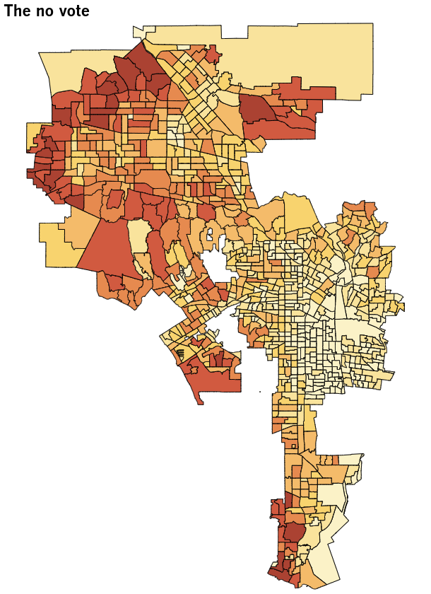

# altair-election-maps-example

An experiment in creating precinct-level election results maps using [Python's Altair library](https://altair-viz.github.io). Data are drawn from the LA's Measure EE, a proposed parcel tax aimed at funding local schools that [failed in a June 2019 vote](https://www.latimes.com/opinion/editorials/la-ed-measure-ee-lausd-fails-20190606-story.html).

